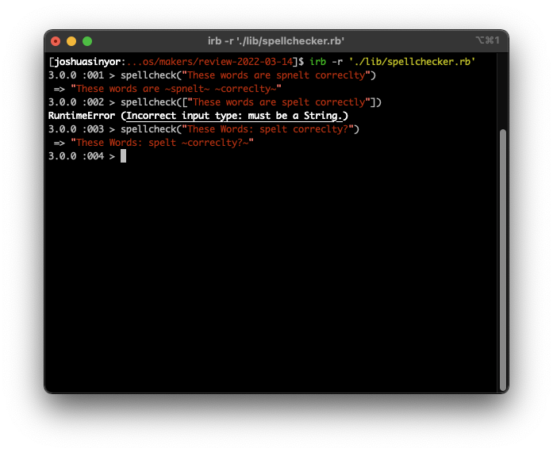

# Makers Review 3

This repository reflects Makers coding review 3, conducted 14/03/2022.

---

- [Installation](#installation)
- [Specification](#specification)
  * [Input/Output Table](#input-output-table)
- [Acceptance Criteria](#acceptance-criteria)
  * [Input/Output Table](#input-output-table)
- [Final Appearance](#final-appearance)
- [Dependencies](#dependencies)
- [Author(s)](#author-s-)
- [License(s)](#license-s-)
- [Acknowledgements](#acknowledgements)

---

## Installation

This project requires Ruby 3.0.0. If you do not have Ruby 3.0.0, install it using [these instructions](https://www.ruby-lang.org/en/documentation/installation/).

1. [Clone](https://docs.github.com/en/github/creating-cloning-and-archiving-repositories/cloning-a-repository) or [fork](https://docs.github.com/en/github/getting-started-with-github/fork-a-repo) this repository.
2. Install the necessary Gems from the `Gemfile` by executing `bundle install`.

---

## Specification

1. This program is a spellchecker for a word processor.
2. Input will be a `String` of words of any length.
3. Incorrectly spelled words should be bracketed with tilde symbols.
4. The reference dictionary should be supplied by the user.
5. If what is input is not a string, the error "Incorrect input type: must be a String." should be raised.

---

## Acceptance Criteria

This program must:

1. [x] Upon input of "These words are spnelt correclty", output "These words are ~spnelt~ ~correclty~".
2. [x] Upon input of something that is not a `String`, raise error `Incorrect input type: must be a String.`.

### Input/Output Table

| Input | Output |
|-------|--------|
| "These words are spnelt correclty" | "These words are ~spnelt~ ~correclty~" |
| ["These words are spelt correctly"] | Error `Incorrect input type: must be a String.` |

---

## Final Appearance

To take a screenshot of the window in Windows, use shortcut `⊞ + Shift + S`. To take a screenshot of the window on OSX, use shortcut `Shift + ⌘ + 5`.

This program is pictured below executing the instructions in the Acceptance Criteria.

---

## Dependencies

This program's dependencies are minimal and relate solely to testing. All dependencies are explicitly invoked in the `Gemfile`.

- [Ruby](https://www.ruby-lang.org/), courtesy of [Yukihiro Matsumoto](https://github.com/matz).
- [RSpec](https://rspec.info/), courtesy of [Jon Rowe](https://github.com/JonRowe), [Benoit Tigeot](https://github.com/benoittgt), [Phil Pirozhkov](https://github.com/pirj), [Xavier Shay](https://github.com/xaviershay) and [Yuji Nakayama](https://github.com/yujinakayama).
- [Rubocop](https://rubocop.org/) and [Rubocop-RSpec](https://github.com/rubocop/rubocop-rspec), both courtesy of [Bozhidar Batsov](https://github.com/bbatsov).
- [SimpleCov](https://github.com/simplecov-ruby/simplecov), courtesy of [Christoph Olszowka](https://github.com/colszowka).
- [SimpleCov-Console](https://github.com/chetan/simplecov-console), courtesy of [Chetan Sarva](https://github.com/chetan).

---

## Author(s)

Authored by [Joshua Sinyor](https://gist.github.com/JoshSinyor).

---

## License(s)

This project is licensed under the [MIT License](LICENSE).

---

## Acknowledgements

* Table of contents generated with [markdown-toc](https://ecotrust-canada.github.io/markdown-toc/).
* Markdown tables generated with [TablesGenerator](https://www.tablesgenerator.com/markdown_tables).
